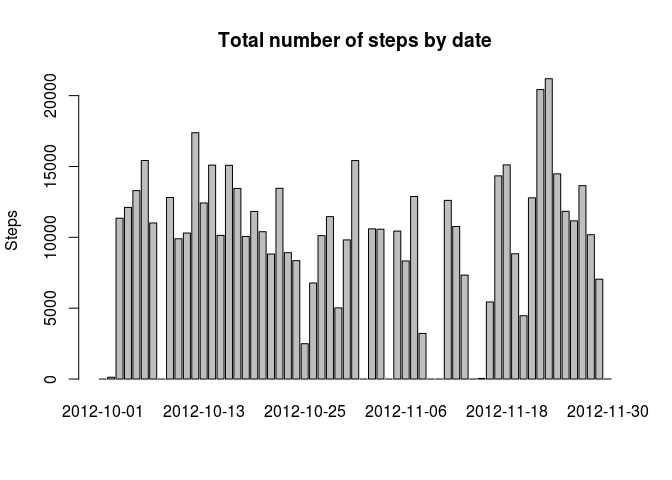
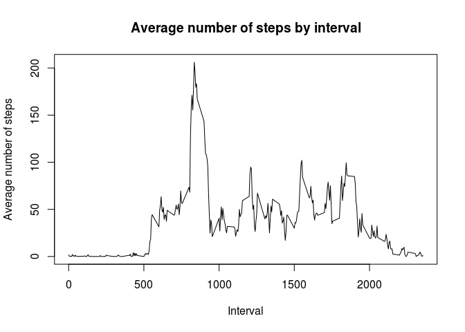
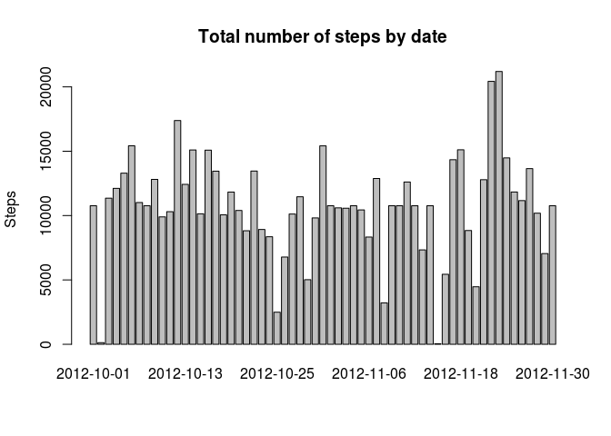
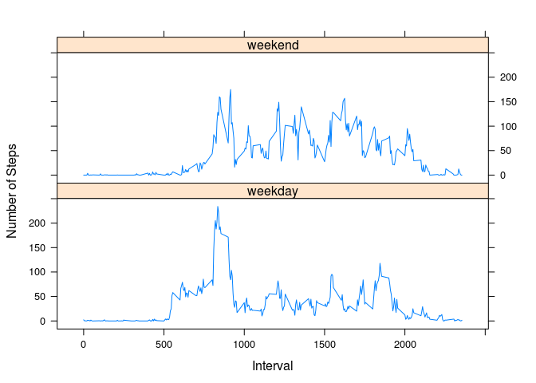

# Reproducible Research: Peer Assessment 1

## Introduction

It is now possible to collect a large amount of data about personal movement using activity monitoring devices such as a Fitbit, Nike Fuelband, or Jawbone Up. These type of devices are part of the “quantified self” movement – a group of enthusiasts who take measurements about themselves regularly to improve their health, to find patterns in their behavior, or because they are tech geeks. But these data remain under-utilized both because the raw data are hard to obtain and there is a lack of statistical methods and software for processing and interpreting the data.

This assignment makes use of data from a personal activity monitoring device. This device collects data at 5 minute intervals through out the day. The data consists of two months of data from an anonymous individual collected during the months of October and November, 2012 and include the number of steps taken in 5 minute intervals each day.

## Loading and preprocessing the data

Let's first load the data.


```r
data <- read.csv (unz ('repdata_data_activity.zip', 'activity.csv'))
data$date <- as.Date (data$date)
```

## What is mean total number of steps taken per day?

We now calculate the total steps by day and show a histogram. Although we call it a histogram, it is actually a bar graph.


```r
steps.by.day <- tapply (data$steps, data$date, FUN=sum, na.rm = TRUE)
barplot (steps.by.day, main = 'Total number of steps by date', ylab = 'Steps')
```

 

Next we will calculate the mean and median value of the total number of steps by date:


```r
mean (steps.by.day)
```

```
## [1] 9354.23
```

```r
median (steps.by.day)
```

```
## [1] 10395
```

## What is the average daily activity pattern?

We will first make a time series plot (i.e. type = "l") of the 5-minute interval and the average number of steps taken, averaged across all days.


```r
steps.by.period = tapply (data$steps, data$interval, FUN = mean, na.rm = TRUE)
#number.days = length (unique (data$date))
#steps.by.period = steps.by.period / number.days
plot (names (steps.by.period), steps.by.period, type='l', main = 'Average number of steps by interval', xlab = 'Interval', ylab = 'Average number of steps')
```

 

We can now find out Which 5-minute interval, on average across all the days in the dataset, contains the maximum number of steps.

The following code find out the interval, in the format of "hhmm", with the leading zero in the hour omitted (if applicable):


```r
m <- max (steps.by.period)
the_interval <- steps.by.period [steps.by.period == m]
names (the_interval)
```

```
## [1] "835"
```

## Imputing missing values

We note that there are a number of days/intervals where there are missing values (coded as NA). The presence of missing days may introduce bias into some calculations or summaries of the data.

WE first calculate and report the total number of missing values in the dataset (i.e. the total number of rows with NAs)


```r
sum (is.na (data$steps))
```

```
## [1] 2304
```

As can be seen, there are a lot of NA in the dataset. These NA will have an impact in out calculation. We therefore must devise a strategy for filling in all of the missing values in the dataset. The strategy does not need to be sophisticated. Here we will use the mean for that 5-minute interval.


```r
bad <- is.na (data$steps)
good.data <- data [!bad,]
bad.data <- data [bad,]
for (i in 1:length (steps.by.period))
{
    period <- names (steps.by.period) [i]
    value <- steps.by.period [i]
    bad.data$steps [bad.data$interval == period] <- value
}
imputted.data <- rbind (good.data, bad.data)
```
    
We now repeat step 1 to make a histogram of the total number of steps taken each day and Calculate and report the mean and median total number of steps taken per day.


```r
steps.by.day <- tapply (imputted.data$steps, imputted.data$date, FUN=sum, na.rm = TRUE)
barplot (steps.by.day, main = 'Total number of steps by date', ylab = 'Steps')
```

 

```r
mean (steps.by.day)
```

```
## [1] 10766.19
```

```r
median (steps.by.day)
```

```
## [1] 10766.19
```

As can be seen, the mean increases by this imputting action, but the median seems not affected.

## Are there differences in activity patterns between weekdays and weekends?

Finally, we want to find out if there are differences in activity patters between weekdays and weekends.

We first create a new factor variable in the dataset with two levels – “weekday” and “weekend” indicating whether a given date is a weekday or weekend day.


```r
weekday <- weekdays (data$date)
weekend <- weekday == 'Saturday' | weekday == 'Sunday'
data$dateType [weekend] <- 'weekend'
data$dateType [!weekend] <- 'weekday'
data$dateType <- as.factor (data$dateType)
```

We now make a panel plot containing a time series plot (i.e. type = "l") of the 5-minute interval (x-axis) and the average number of steps taken, averaged across all weekday days or weekend days (y-axis).


```r
# we first collect data into another data frame
data$newIndex <- paste(data$dateType, data$interval)
data.average <- tapply (data$step, data$newIndex, mean, na.rm = TRUE)
data.average <- data.frame (steps = data.average, interval = as.numeric (substring (names (data.average), 9)), dateType = substring (names (data.average), 1, 7), stringsAsFactors = TRUE)
data.average <- data.average [order (data.average$interval), ]
# we are using the lattice plotting facility
require (lattice)
```

```
## Loading required package: lattice
```

```r
xyplot (steps ~ interval | dateType, data = data.average, layout = c (1, 2), type = 'l', xlab = 'Interval', ylab = 'Number of Steps')
```

 

From the charts above, it clearly shows that the activity patterns are different between weekdays and weekends.
